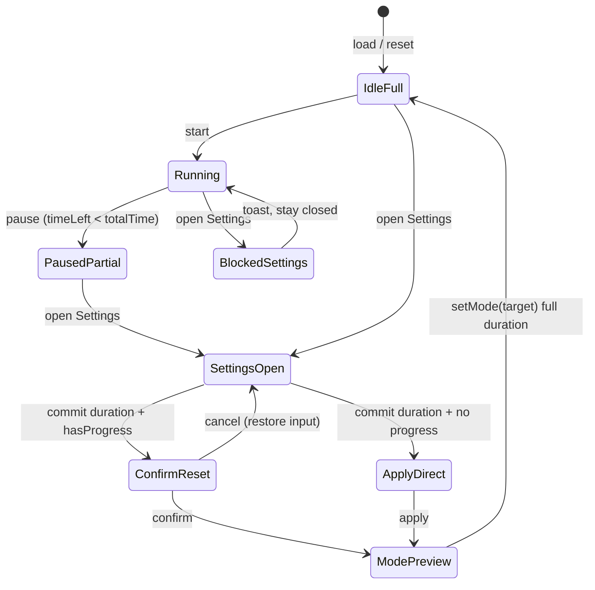

# feat: Settings Mode Preview

## Summary

Block Settings while the timer is running, and when a focus/short/long duration is committed, switch to the matching main tab and show the new full duration. If the timer has already consumed time, require confirmation before applying; cancel restores the previous value without saving.

## Problem Frame

Duration changes today only refresh the main timer when the user is already on the matching mode tab. Users cannot preview a new duration on the correct tab without manual switching, and mid-session edits can silently adjust remaining time. (see origin: `docs/brainstorms/2026-05-31-settings-mode-preview-requirements.md`)

## Requirements

Traceability to origin R-IDs:

- R1. Block Settings open while `state.running === true`; show pause-first message.
- R2. Allow Settings when paused or idle.
- R3. On duration commit with timer progress, show reset confirmation.
- R4. On confirm: save, switch tab, show full new duration.
- R5. On cancel: do not save; restore input and stored setting to pre-edit value.
- R6. On duration commit without progress: apply without confirm, switch tab, show full duration.
- R7–R9. Focus / short / long duration → matching mode tab.
- R10. Apply on every successful commit via ±, blur, or Enter; skip when value unchanged.
- R11. Pomodoro count changes: no mode switch, no duration-reset confirm.

## Key Technical Decisions

**KTD1. Reuse `setMode()` for post-apply navigation and full timer reset**

After a successful duration apply, call existing `setMode(targetMode)` so the tab, ring, labels, and timer display all reset to the new full duration. This replaces the current same-mode elapsed-preservation branch in `applySettingValue` for duration settings. (see origin: scheme one / R4, R6)

**KTD2. Reuse `hasTimerProgress()` as the confirm gate**

Use the same signal as `requestModeChange`: `state.running || state.timeLeft !== state.totalTime`. Settings open is blocked separately when `state.running` (R1); confirm applies when paused with partial progress. (see origin: R3)

**KTD3. Confirm before mutating state; capture rollback snapshot**

Before changing `state.settings` or the timer, store `previousValue` from `state.settings[config.key]`. On cancel, restore the input via `syncSettingsInputs()` or direct assignment and leave timer/state untouched. (see origin: R5)

**KTD4. Split duration apply from pomodoro-count apply**

Route `inputFocus`, `inputShort`, `inputLong` through a new duration-specific apply path (confirm → save → `setMode`). Keep `inputPomodoros` on the existing lightweight path (update setting + dots only). (see origin: R11)

**KTD5. Toast for blocked Settings; `confirm()` for reset warning**

Match existing UX patterns: `showToast` for R1 block message; native `confirm()` for reset dialog (consistent with mode-tab switch). Message should state that modifying duration will restart the timer from the new full length.

## High-Level Technical Design

Duration commit flow (focus / short / long only):

1. Parse and clamp value (existing logic).
2. If unchanged → return early (R10).
3. If `hasTimerProgress()` → `confirm()`; on cancel → restore input, return (R5).
4. Write `state.settings[key] = next`, update input display.
5. Call `setMode(modeForSetting)` → user sees matching tab at full new duration (R4, R6–R9).
6. `updatePomodoroDots()`, `saveState()`.

## Scope Boundaries

**In scope**

- Settings gate while running (R1–R2)
- Duration confirm / cancel / apply / mode switch (R3–R10)
- Pomodoro count exclusion (R11)

**Deferred for later**

- Disabled visual state on Settings button while running (origin: toast-only v1)
- Escape-to-close Settings while input focused (pre-existing)
- Reducing confirm frequency during stepper hold-repeat (origin requires per-commit apply; accept confirm on each step when progress exists)

**Deferred to Follow-Up Work**

- Automated test harness for `index.html` (no existing test infrastructure)

**Outside this product's identity**

- Cloud-synced settings, separate preview mode (from origin)

## Implementation Units

### U1. Block Settings while timer is running

**Goal:** Prevent opening Settings during active countdown; instruct user to pause first.

**Requirements:** R1, R2

**Dependencies:** None

**Files:** `index.html`

**Approach:** In the Settings button click handler, if `state.running`, call `showToast('请先暂停计时器')` (or equivalent) and return without opening the panel. Leave stats drawer unchanged.

**Patterns to follow:** Existing `$btnSettings` handler (~line 1855); existing `showToast` usage.

**Test scenarios:**

- Covers AE1. Timer running on any mode → tap Settings → panel stays closed, toast shown.
- Timer paused at partial time → Settings opens normally.
- Timer idle at full duration → Settings opens normally.

**Verification:** Manual browser check for AE1 and R2 paths.

**Test expectation:** none — no automated test suite; manual verification only per `AGENTS.md`.

---

### U2. Duration apply pipeline with confirm, cancel restore, and mode switch

**Goal:** Refactor duration setting commits so they confirm when progress exists, restore on cancel, and always preview via `setMode`.

**Requirements:** R3–R10, F2, F3

**Dependencies:** U1 (Settings only reachable when paused/idle; running case already blocked)

**Files:** `index.html`

**Approach:**

- Introduce `SETTING_TO_MODE` map: `inputFocus → focus`, `inputShort → short`, `inputLong → long`.
- Replace duration branch inside `applySettingValue` (or add `applyDurationSetting(id, value, options)`) with:
  - Early return if value unchanged (keep clamp toast via `notifyClamp`).
  - Snapshot `previous = state.settings[config.key]`.
  - If `hasTimerProgress()` and not confirmed → restore input to `previous`, return.
  - Persist setting, then `setMode(SETTING_TO_MODE[id])` instead of elapsed-preservation math.
- Wire callers unchanged: `stepSetting`, `setupSettingInputs` change/blur/Enter.
- Preserve existing clamp toast behavior for direct input.

**Patterns to follow:** `requestModeChange` confirm pattern; `setMode` for full reset; existing `applySettingValue` clamp/notifyClamp.

**Test scenarios:**

- Covers AE2. Focus tab, idle 25:00, change short to 8 via + → Short Break tab, 08:00.
- Covers AE3. Focus paused 18:00, change focus to 30, confirm → Focus tab, 30:00.
- Covers AE4. Focus paused 18:00, change focus to 30, cancel → setting 25, input 25, display 18:00.
- No progress: change long 15→20 via Enter → Long Break tab, 20:00, no confirm.
- With progress: each + click on focus duration prompts confirm (R10).
- Changing focus duration while on Short Break tab with short-break progress → confirm, then Focus tab at new full focus duration.

**Verification:** Walk through AE2–AE4 in browser; confirm `localStorage` `pomodoro-state` reflects saved durations after apply.

**Test expectation:** none — manual verification.

---

### U3. Preserve pomodoro-count behavior and regression sweep

**Goal:** Ensure `inputPomodoros` changes do not trigger mode switch or duration-reset confirm.

**Requirements:** R11, AE5

**Dependencies:** U2

**Files:** `index.html`

**Approach:** Keep pomodoro count on existing `applySettingValue` path without `setMode` or duration confirm. After U2 refactor, explicitly branch: duration IDs → new pipeline; `inputPomodoros` → setting update + `updatePomodoroDots()` only.

**Test scenarios:**

- Covers AE5. Change pomodoros 4→6 from any tab → no tab switch, no confirm, dots update.
- Stepper ± on pomodoros with timer progress → no confirm (count is not a duration).
- Stats / particles toggle unchanged.

**Verification:** AE5 manual pass; quick smoke of timer start/pause/reset and mode tabs still work.

**Test expectation:** none — manual verification.

## Risks and Mitigations

| Risk | Mitigation |
|------|------------|
| Confirm fatigue on stepper hold when progress exists | Accepted per origin R10; note in deferred if user feedback warrants |
| `setMode` clears `state.running` — user paused then edits | Intended: apply happens while paused; `setMode` keeps paused idle full duration |
| Switching mode loses in-progress time on non-target mode | User confirms reset; copy should say timer restarts from new full duration |

## Sources and Research

- Origin: `docs/brainstorms/2026-05-31-settings-mode-preview-requirements.md`
- Existing helpers: `hasTimerProgress`, `requestModeChange`, `setMode`, `applySettingValue`, `setupSettingInputs`, `setupStepperControls` in `index.html`
- Constraint: `AGENTS.md` — single-file, no build, no committed test artifacts

## Open Questions

None — origin outstanding questions empty.
