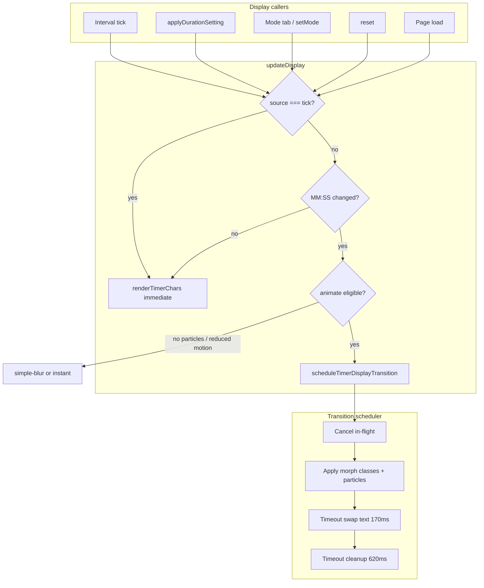
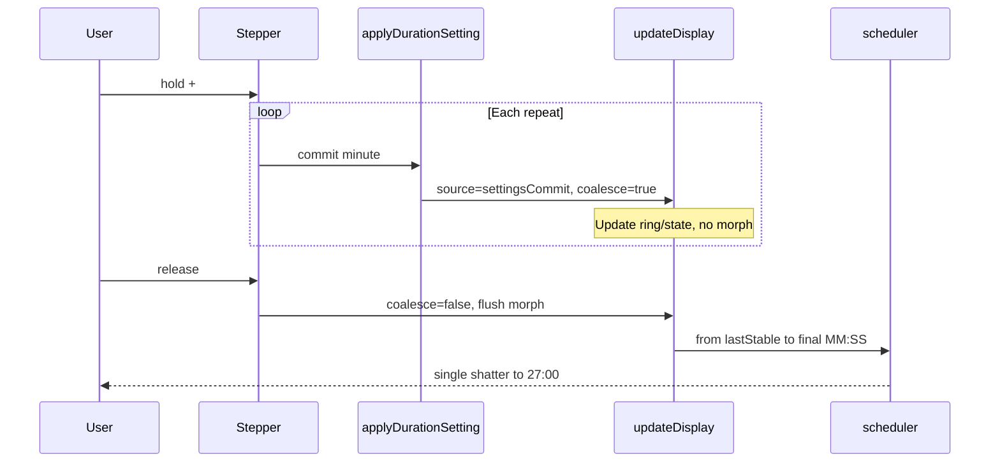

# feat: Digit Particle Trigger & Transition Scheduler

## Summary

Make digit shatter particles fire reliably whenever the main timer `MM:SS` changes outside the one-second countdown tick—especially after Settings duration commits. Introduce explicit display change sources and a single transition scheduler that owns diff, morph, particles, and cleanup. Coalesce rapid stepper input so one morph runs to the final time after the user releases +/−.

## Problem Frame

Users see inconsistent particle feedback when adjusting durations in Settings: sometimes the shatter plays, sometimes it does not. Animation today depends on a boolean `animate` flag on `setTimerText`, reached mainly via `setMode` → `updateDisplay(true)`. Rapid stepper repeats apply and re-enter `setTimerText` while a prior `timerTextTransition` is still clearing timeouts—producing races and dropped effects. (see origin: `docs/brainstorms/2026-05-31-digit-particle-trigger-requirements.md`)

Settings mode preview is already implemented (`docs/plans/2026-05-31-001-feat-settings-mode-preview-plan.md`); this plan only fixes trigger policy and transition plumbing so preview commits and particles stay aligned.

## Requirements

Traceability to origin R-IDs:

**Trigger rules**

- R1. Non-tick `MM:SS` changes with particles on and no reduced motion → animated digit transition when at least one character differs.
- R2. Running countdown tick → plain display update, no morph or particles.
- R3. Successful focus/short/long duration commits that change displayed `MM:SS` → animated path.
- R4. Mode tab switches, reset, and other non-tick updates that change `MM:SS` → same animated path as R1.
- R5. Unchanged displayed `MM:SS` (unchanged setting, canceled confirm) → no morph.
- R6. Particles off → existing `simple-blur` fallback on eligible updates.

**Rapid input coalescing**

- R7–R9. Rapid stepper: defer morph until input pauses; final morph from last stable `MM:SS` to final; ring/display match final value.

**Transition reliability & structure**

- R10. One active transition; supersede deterministically.
- R11. Classify change source: tick, settings commit, mode change, reset, init/other.
- R12–R13. Scheduler owns diff, morph, particles, timers, cleanup.

**Performance & a11y**

- R14–R15. Batch layout reads; no orphaned timers/DOM.
- R16–R17. Reduced motion and particles toggle unchanged in behavior.

## Key Technical Decisions

**KTD1. Replace `updateDisplay(animateTimer: boolean)` with `updateDisplay({ source })`**

Sources (minimum set): `tick`, `settingsCommit`, `modeChange`, `reset`, `init`. Animation eligibility: `source !== 'tick'` AND displayed `MM:SS` will change AND not `prefers-reduced-motion`. Particles branch still respects `state.settings.particles`. (see origin: R1–R2, R11)

**KTD2. Central `scheduleTimerDisplayTransition({ fromText, toText, mode })` scheduler**

Extract logic from `setTimerText` into a cohesive block (~lines 1280–1442 region). Responsibilities: diff indices, start morph/particles, swap at 170ms, cleanup at 620ms, cancel in-flight on supersede. Replace ad-hoc `timerTextTransition` object with a single module-level handle exposing `cancel()` / `commit()`. (see origin: R10–R13, R12)

**KTD3. Track `lastStableDisplayedText` for coalescing baseline**

`currentTimerText` updates on every render; coalescing needs the last string shown *before* a burst of stepper commits. Set `lastStableDisplayedText` when a morph completes or when a non-coalesced update finishes; during stepper hold, do not update it until `stopStepperHold`. (see origin: R7–R9)

**KTD4. Stepper hold: apply state immediately, morph on release**

During `startStepperHold` repeat ticks: continue calling `applyDurationSetting` / `setMode` so settings and ring reflect each minute, but pass `suppressMorph: true` (or `source: 'settingsCommit'` with coalesce flag) into display refresh. On `stopStepperHold` (pointerup/cancel/blur/window pointerup): one `scheduleTimerDisplayTransition` from `lastStableDisplayedText` → `formatTime(state.timeLeft)`. (see origin: R7–R8, AE2)

**KTD5. Coalesce end trigger = stepper release, not a debounce timer**

End coalescing on existing `stopStepperHold` paths (pointerup, pointercancel, pointerleave, blur, window pointerup). Avoid adding a separate debounce window unless manual testing shows release-only misses edge cases. (see brainstorm: user chose final morph only)

**KTD6. `setMode` accepts display options; avoid double animation**

`setMode(mode, { displaySource })` should call `updateDisplay({ source: displaySource })` once. Settings path: `applyDurationSetting` → `setMode(target, { displaySource: 'settingsCommit' })` with coalesce flag during hold. Mode tab clicks use `modeChange`; `reset` uses `reset`. (see origin: R3–R4)

**KTD7. Batch layout measurement per morph**

In `createDigitDissolveParticles`, read `$display.parentElement.getBoundingClientRect()` once per morph pass; per changed index read char rect once; spawn particles without re-reading container rect inside the particle loop. (see origin: R14)

## High-Level Technical Design

## Scope Boundaries

**In scope**

- Change-source classification and scheduler refactor (R1–R13)
- Stepper coalescing on release (R7–R9)
- Layout read batching (R14)
- Manual verification matrix (AE1–AE6)

**Deferred for later**

- Particles on every countdown second (origin)
- Ambient `#particles` background redesign (origin)
- Easing/visual polish beyond obvious desync fixes (origin)
- Automated test harness for `index.html`

**Deferred to Follow-Up Work**

- Optional debounce fallback if release-only coalescing fails edge cases in QA

**Outside this product's identity**

- Multi-file runtime, bundlers (per `AGENTS.md`)

## Implementation Units

### U1. Display change sources and `updateDisplay` gate

**Goal:** Replace the boolean animate flag with explicit sources so tick updates never request animation.

**Requirements:** R1, R2, R5, R11, R16

**Dependencies:** None

**Files:** `index.html`

**Approach:**

- Add a small constant map or string union for display sources.
- Change `updateDisplay(animateTimer)` to `updateDisplay({ source, coalesceMorph })` (coalesce flag used by U3).
- Compute `nextText = formatTime(state.timeLeft)`; compare to `currentTimerText` or `lastStableDisplayedText` per coalesce state.
- If `source === 'tick'` or no text change → render immediately, no scheduler.
- If animate eligible → delegate to U2 scheduler; else existing instant / simple-blur paths.
- Update call sites: interval → `tick`; `setMode` → `modeChange` (or `settingsCommit` when invoked from duration apply); `reset` → `reset`; initial load → `init`.

**Patterns to follow:** Existing `updateDisplay` ring/background logic unchanged below the `setTimerText` call.

**Test scenarios:**

- Covers AE4. Given particles on and timer running at 24:59, when one second elapses, then display shows 24:58 with no morph class and no `.digit-dissolve-field` in DOM.
- Given idle full timer, when `updateDisplay({ source: 'tick' })` is invoked in isolation (dev console), then digits update without animation.
- Given reduced motion media query matches, when non-tick source changes MM:SS, then text updates immediately with no particles.

**Verification:** All `updateDisplay(` call sites use `source`; grep shows no remaining `updateDisplay(true)` / `updateDisplay(false)`.

---

### U2. Transition scheduler (extract from `setTimerText`)

**Goal:** One owner for morph timing, particle spawn, supersede, and cleanup.

**Requirements:** R1, R4, R6, R10, R12, R13, R17

**Dependencies:** U1

**Files:** `index.html`

**Approach:**

- Introduce `scheduleTimerDisplayTransition({ fromText, toText })` and `cancelTimerDisplayTransition()`.
- Move diff, morph class toggles, `timerTextTransition` swap/done timeouts, and `clearDigitDissolveFields` into scheduler.
- On new schedule while active: cancel prior timeouts, remove particle fields, then start fresh (R10).
- Thin `setTimerText` to: read policy → call scheduler or `renderTimerChars`.
- Preserve timing constants (170ms swap, 620ms done, 680ms particle field removal) unless desync is observed in QA.
- On `done`, set `currentTimerText` and `lastStableDisplayedText` to `toText`.

**Patterns to follow:** Existing `setTimerText` particle branch and `simple-blur` fallback; `TIMER_PARTICLE_COLORS[state.mode]`.

**Test scenarios:**

- Covers AE1. Given particles on, short break 05:00 visible, when focus duration committed 25→30, then focus tab shows 30:00 with particles on changed digit indices.
- Covers AE5. Given morph in flight, when second duration commit changes MM:SS again before 620ms, then display ends on latest MM:SS without stuck morph classes or leftover `.digit-dissolve-field`.
- Covers AE6. Given particles toggle off, when duration commit changes MM:SS, then simple-blur runs and no digit particles spawn.
- Given unchanged MM:SS with non-tick source, when update runs, then scheduler is not invoked.

**Verification:** Only scheduler module sets `timerTextTransition` timers; supersede path manually tested twice in quick succession.

---

### U3. Stepper hold coalescing

**Goal:** Rapid +/− applies settings immediately but plays one morph after release.

**Requirements:** R3, R7, R8, R9, R15

**Dependencies:** U1, U2

**Files:** `index.html`

**Approach:**

- Add module flag `stepperMorphCoalesce` (or pass through `stepperHold` object) set true when `startStepperHold` runs; cleared in `stopStepperHold`.
- While coalescing: `applyDurationSetting` → `setMode` still runs (settings preview intact); display refresh uses `coalesceMorph: true` so ring/state update without scheduler.
- On `stopStepperHold`: if `formatTime(state.timeLeft) !== lastStableDisplayedText`, call scheduler once from stable → final; then clear coalesce flag.
- Ensure window `pointerup` / `stopStepperHold` always flushes coalesce even if pointer leaves button (R8).

**Patterns to follow:** Existing `stepperHold` / `startStepperHold` / `stopStepperHold` (~1587–1646); do not change confirm/cancel behavior in `applyDurationSetting`.

**Test scenarios:**

- Covers AE2. Given focus tab 25:00 and particles on, when user holds + through 26 and 27 then releases, then one morph to 27:00 and setting value 27.
- Given hold + then cancel (pointercancel), when stopStepperHold runs, then display matches final applied value (no stuck coalesce flag).
- Given single + click (no hold), when step completes, then morph runs immediately (coalesce flag never set).

**Verification:** Record screen or observe DOM: one `.digit-dissolve-field` burst per release after rapid hold, not per intermediate minute.

---

### U4. Layout batching and particle DOM hygiene

**Goal:** Reduce layout thrash and ensure cleanup on supersede.

**Requirements:** R14, R15

**Dependencies:** U2

**Files:** `index.html`

**Approach:**

- Refactor `createDigitDissolveParticles` to accept precomputed `{ centerX, centerY, color }` per changed index from one container rect + per-char rects pass.
- Scheduler calls layout pass once before spawning all fields for changed indices.
- `cancelTimerDisplayTransition` clears all pending field removal timeouts and removes `.digit-dissolve-field` nodes immediately.

**Patterns to follow:** Existing particle count/random CSS variable generation.

**Test scenarios:**

- Given morph with two changed digit indices, when particles spawn, then one container `getBoundingClientRect` occurs before particle creation (verify via temporary counter or DevTools Performance if needed).
- Given supersede during morph, when new morph starts, then no `.digit-dissolve-field` older than current transition remains after 700ms.

**Test expectation:** none for automated suite — manual DOM inspection only.

**Verification:** No growth of `.digit-dissolve-field` count after 10 rapid superseding commits.

---

### U5. Manual regression pass

**Goal:** Confirm origin acceptance examples and settings-preview compatibility.

**Requirements:** AE1–AE6; F1–F5 from origin

**Dependencies:** U1–U4

**Files:** `index.html` (verification only)

**Approach:** Execute checklist in browser on `feat/digit-particle-trigger` by opening `index.html` locally. Document results in PR description or commit message, not a committed report file.

**Test scenarios:**

- Run AE1–AE6 verbatim from origin doc.
- AE3: cancel duration confirm → no morph, value restored.
- Mode tab switch while particles on: morph when MM:SS changes.
- Pomodoro count change: no morph (out of particle scope but sanity check).

**Verification:** All AE cases pass; no regressions in settings-mode-preview flows (block while running, confirm on progress).

## Risks & Dependencies

| Risk | Mitigation |
|------|------------|
| Double morph if `setMode` and flush both schedule | Single display entry through `updateDisplay`; coalesce flag blocks scheduler during hold |
| Display shows intermediate minute without morph during hold | Acceptable per R8; user still sees ring/time update; morph on release |
| `lastStableDisplayedText` drifts from visible text | Update only on completed morph and non-coalesced instant renders |
| Settings preview plan regression | Re-run AE2 from settings plan + AE1 from this plan |

**Dependency:** Settings mode preview already shipped in `index.html`; no dependency on incomplete preview work.

## Sources & Research

- Origin: `docs/brainstorms/2026-05-31-digit-particle-trigger-requirements.md`
- Related: `docs/brainstorms/2026-05-31-settings-mode-preview-requirements.md`, `docs/plans/2026-05-31-001-feat-settings-mode-preview-plan.md`
- Constraints: `AGENTS.md` (single-file static app)
- Code: `setTimerText`, `updateDisplay`, `applyDurationSetting`, `setMode`, stepper hold block in `index.html`
- Learnings: none in `docs/solutions/`; first opportunity to compound after ship
